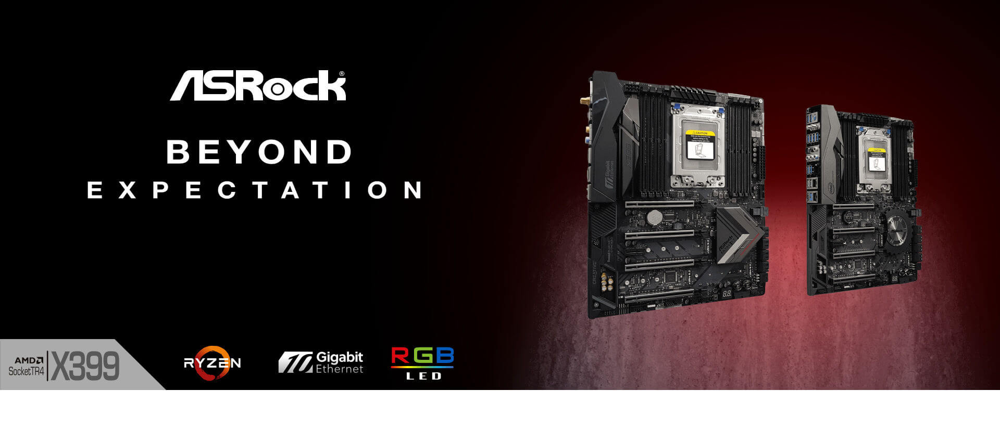

# College of Multimedia Opdracht HE-4

__Opdrachtomschrijving__

"Maak voor moederbordfabrikant ASRock een aantrekkelijke interactieve HTML5 canvas banner. Werk je project uit met Adobe Animate en gebruikt het GreenSock Animation Platform (GSAP)."

__Live demo__

[Live demo project HE-4](https://cmm-front-end-developer-module-2-he-4.netlify.app)

## Uitwerking Project HE-4

